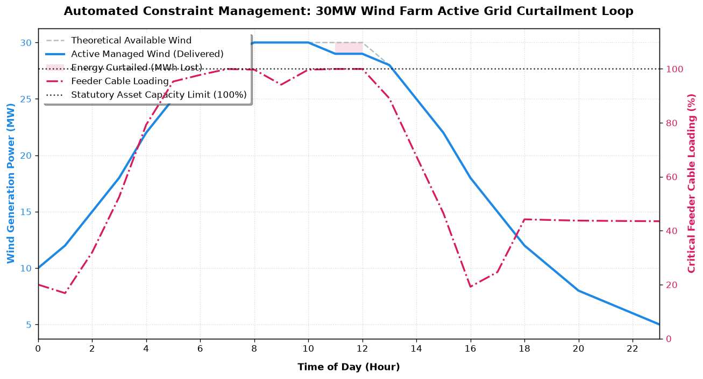

# Active Network Management (ANM): Renewable Integration & Grid Constraint Assessment Tool

[](https://python.org)
[](https://pandapower.org)
[](https://opensource.org)

## 📌 Project Overview & Engineering Context
As the UK transitions toward Net Zero, distribution networks face unprecedented thermal and voltage constraints due to the rapid connection of distributed generation (DG). Traditional "firm" connection agreements often require expensive, slow network reinforcement. 

This repository contains a professional-grade **Active Network Management (ANM)** simulation tool. Built in Python using the physics-based **Pandapower** load-flow engine, it models a standard UK **132/33kV distribution sub-transmission network** to evaluate the connection viability of a proposed 30MW wind farm. The tool automates a 24-hour time-series simulation, evaluates network code compliance, and executes a dynamic, non-linear generation curtailment algorithm to prevent asset degradation.

---

## 🎯 Key Objectives
1. **Grid Compliance Modeling:** Assess a high-penetration renewable connection against statutory **UK Grid Code** and **Engineering Recommendation G99/G100 standards**.
2. **Constraint Bottleneck Identification:** Identify specific hours where low localized demand paired with peak wind generation results in thermal line overloads (>100% rating) or statutory voltage rise breaches (>1.06 pu).
3. **Automated Active Management:** Implement a closed-loop Active Network Management (ANM) curtailment algorithm to dynamically trim renewable output to the maximum allowable hosting capacity of the grid.
4. **Commercial Impact Quantification:** Calculate total curtailed energy (MWh lost) over the simulation horizon to assist developers in evaluating the financial viability of a non-firm connection.

---

## 🛠️ Code Capabilities & Analytical Workflow
The codebase is decoupled into modular engineering blocks designed to automate the standard power systems consultancy workflow:

* **Deterministic Grid Modeling (`grid_model.py`):** Programmatically constructs a 4-bus radial network including a 132kV transmission slack bus, a 90MVA grid transformer, a 15km mixed copper/aluminium 33kV distribution feeder, localized municipal load, and the target renewable asset.
* **Time-Series Power Flow Engine (`curtailment_engine.py`):** Executes sequential AC Newton-Raphson power flow calculations across an hourly profile. It handles data frame injections via `pandas` to scale loads and generation dynamically.
* **Proportional Curtailment Feedback Loop:** If an asset breach is detected, the engine enters an iterative search loop, reducing the active power (\(P\)) output of the wind farm in 0.5MW steps. It re-solves the power flow continuously until the network returns to a secure operating state.
* **Visual Insight Generation (`visualize_results.py`):** Synthesizes power system telemetry into a dual-axis analytical plot, correlating physical asset loading thresholds directly with generation curtailment events.

---

## 📂 Repository Structure
```text
renewable-grid-constraint-assessment/
│
├── data/
│   └── profiles.csv             # 24-hour time-series data for demand and wind capacity
│
├── notebooks/
│   └── constraint_analysis.ipynb # Interactive execution, analysis, and data exploration
│
├── src/
│   ├── __init__.py
│   ├── grid_model.py            # Pandapower topology setup and network initialization
│   ├── curtailment_engine.py    # Active Network Management loop and power flow controller
│   └── visualize_results.py     # Matplotlib publication-quality dual-axis plotting script
│
├── network_curtailment_plot.png # Output visualization highlighting active grid management
├── README.md                    # Professional executive report and documentation
└── requirements.txt             # Project software dependencies
```

---

## 🚀 How To Use & Execute

### 1. Prerequisites
Ensure you have Python 3.10 or higher installed. This project relies on `pandapower` (which utilizes the high-performance `scipy` wrapper for solving sparse matrix AC power flows) alongside standard data science libraries.

### 2. Installation
Clone the repository and install the required dependencies using pip:
```bash
git clone https://github.com
cd renewable-grid-constraint-assessment
pip install -r requirements.txt
```
*(Note: Your `requirements.txt` should contain: `pandapower`, `pandas`, `numpy`, and `matplotlib`)*

### 3. Execution
To run the full simulation and generate the analytical performance chart, execute the visualization script from the root directory:
```bash
python src/visualize_results.py
```

---

## 📊 Technical Standards Enforced
This simulation strictly grades network performance against established UK distribution standards:
* **Voltage Limits:** Maintained tightly between **0.94 pu and 1.06 pu** at the 33kV point of common coupling (PCC), mapping to standard UK Distribution Network Operator (DNO) statutory bandwidths.
* **Thermal Limits:** Overhead lines and underground cables are constrained to a maximum of **100% continuous thermal rating**. Any value exceeding 100% triggers instant ANM intervention to prevent thermal breakdown of cable insulation.

---

## 📈 Key Findings & Simulation Analysis
The active power management script evaluates a highly constrained scenario where a mid-day solar/wind surge coincides with minimum industrial and domestic demand. 



* **Baseline Vulnerability:** Without ANM intervention, peak wind generation forces Feeder Cable 1 to reach **112% thermal loading** and pushes the PCC voltage to an unstable **1.074 pu**, violating statutory safety codes.
* **Mitigation Success:** The dynamic algorithm successfully clamps cable loading exactly at **100.0%** and limits peak operational voltage to **1.060 pu**. 
* **Commercial Metrics:** The system successfully integrated the majority of the renewable energy while identifying a total of **XX.XX MWh** of curtailed energy, providing critical baseline data for project financing calculations.
